# svg-cardcraft

Dynamic animated SVG cards for GitHub READMEs and beyond.

**API-driven. Configurable. Beautiful. No JavaScript on render.**

## Preview

<p align="center">
  
</p>

<p align="center">
  &nbsp;&nbsp;
  
</p>

## Card Types

### Hero Card
Animated gradient background with floating particles, rotating taglines (cycles through your roles/titles), social links, and subtitle.

### Stats Dashboard
Live GitHub statistics pulled from the API — repos, followers, following, gists — with animated counters and accent color bar.

### Quote Rotator
Elegant daily-rotating quotes with serif typography, fade-in animation, and decorative quotation marks.

## Quick Start

```bash
npm install
npm run build
npm run generate          # reads cardcraft.json, writes to output/
```

## Configuration

Edit `cardcraft.json`:

```json
{
  "cards": [
    {
      "type": "hero",
      "config": {
        "name": "Your Name",
        "taglines": ["Developer", "Builder", "Creator"],
        "gradientColors": ["#6366f1", "#8b5cf6", "#ec4899", "#06b6d4"]
      }
    },
    {
      "type": "stats",
      "config": { "username": "your-github-username" }
    },
    {
      "type": "quote",
      "config": {
        "quotes": [
          { "text": "Your favorite quote.", "author": "Author" }
        ]
      }
    }
  ]
}
```

## Clickable Links in GitHub READMEs

SVG `<a href>` links **do not work** when embedded via `` or ``  on GitHub — the SVG is rendered as a static image. GitHub strips all interactive elements for security.

**What works:**

| Method | Links work? | Notes |
|--------|:-----------:|-------|
| `` | No | Rendered as ``, no interaction |
| `` | No | Same — `` strips links |
| `<object data="image.svg">` | Stripped | GitHub removes `<object>` tags |
| `[](url)` | **Yes** | Wraps entire SVG in a markdown link |

The **only reliable approach** is wrapping the SVG image in a markdown link:

```markdown
[](https://your-url.com)
```

This makes the entire card clickable. For multiple link targets from a single SVG, use an [image map](https://developer.mozilla.org/en-US/docs/Web/HTML/Element/map) or split into separate SVG cards.

## Design Principles

- **Self-contained SVGs** — no external resources, no JavaScript
- **GitHub sandbox safe** — works within GitHub's SVG sanitizer
- **Accessible** — `prefers-reduced-motion` and `prefers-color-scheme` support
- **Secure** — all dynamic content XML-escaped to prevent injection
- **API-driven** — cards fetch live data and gracefully degrade on failure

## Tech Stack

TypeScript, Node.js 22+, zero runtime dependencies.

## License

MIT
